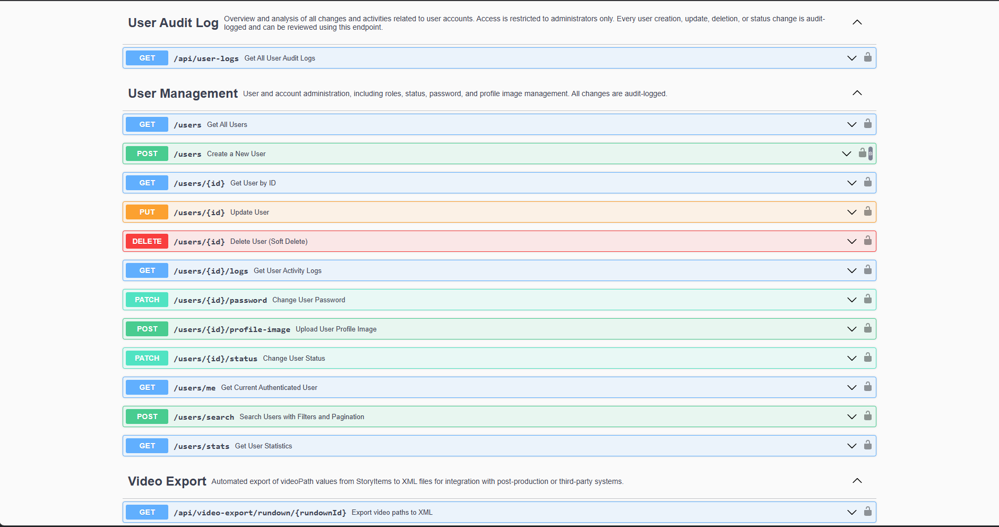
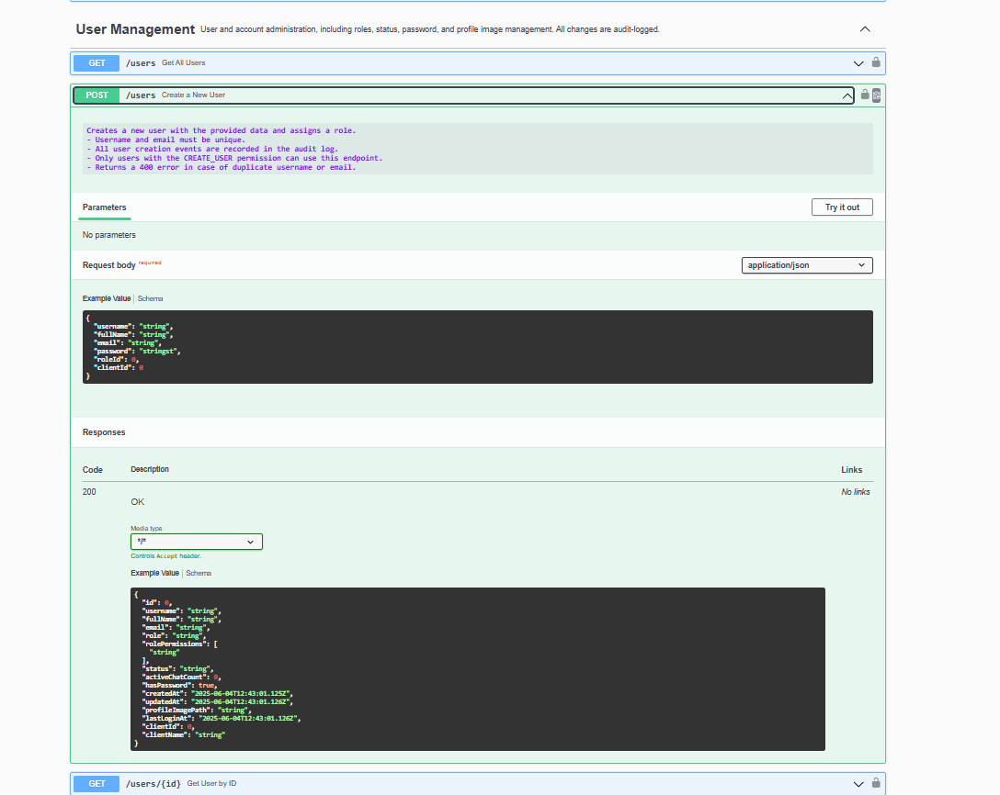

# spring-boot-backend-portfolio

This codebase is curated and maintained by Urke, a backend engineer specializing in enterprise Java/Spring Boot solutions. It demonstrates best practices in modern backend architecture, API design, and production-quality engineering.

This repository demonstrates an extensible, production-grade backend platform tailored for newsrooms, broadcast, and automation use cases. It showcases how to architect, document, and secure a modern Java backend following best enterprise practices.

## Features

- REST API with Swagger/OpenAPI documentation
- Real-time WebSocket messaging (user presence, chat events)
- Custom JWT authentication/authorization
- Modular, domain-driven design
- Advanced file & media storage management
- Integration: MOS TCP server (Netty), automation protocols
- Audit logging, user management, multi-tenancy

## Technologies

- Java 17+
- Spring Boot, Spring Security, Spring Data JPA
- Netty (TCP server)
- STOMP/WebSocket
- MariaDB/MySQL
- Gradle/Maven

## How to Run

1. Configure database in `application.properties`
2. Run: `./gradlew bootRun`

## Example API Usage

### User Authentication (Login)
```http
POST /api/auth/login
Content-Type: application/json

{
  "username": "admin",
  "password": "admin123"
}

```

```json
{
  "accessToken": "...",
  "refreshToken": "...",
  "tokenType": "Bearer",
  "username": "admin",
  "fullName": "Admin",
  "role": "ADMIN",
  "user_id": 6
}
```

### Create New User

```http
POST /api/users
Authorization: Bearer <token>
Content-Type: application/json

{
  "username": "johndoe",
  "fullName": "John Doe",
  "email": "john@example.com",
  "password": "SuperSecret123",
  "roleId": 2,
  "clientId": 1
}

```

## Project Structure

- `NmsServerApplication` — Spring Boot entrypoint, app lifecycle hooks
- `config/` — Security, WebSocket, storage, Swagger, CORS, persistence and all application configuration
- `controller/` — REST and WebSocket controllers (users, stories, rundown, chat, media, MOS integration, etc.)
- `domain/` — JPA entities and enums (User, Story, StoryItem, Rundown, etc.)
- `dto/` — DTOs for requests, responses, filtering, search
- `repository/` — Spring Data repositories for all main entities
- `service/` — Core business logic and feature orchestration (including helpers)
- `tcp/` — Netty TCP server and MOS protocol handlers
- `websocket/` — WebSocket events, session listeners, presence tracking
- `exception/` — Global and domain exception handling
- `util/` — Utility/helper classes (PDF, Word, metadata, etc.)

### API Documentation (Swagger UI Example)

This project provides fully documented REST endpoints using Swagger/OpenAPI.
Below are example screenshots from the live API documentation:

**User Management endpoints overview:**



**Create User endpoint detail:**




## Portfolio & Contact

For more information, proposals, or consulting inquiries, please contact via Upwork.

## License

This project is provided as a demonstration portfolio and is not licensed for production use without consent.

## Contribution

Portfolio-only: not accepting external contributions at this time.
