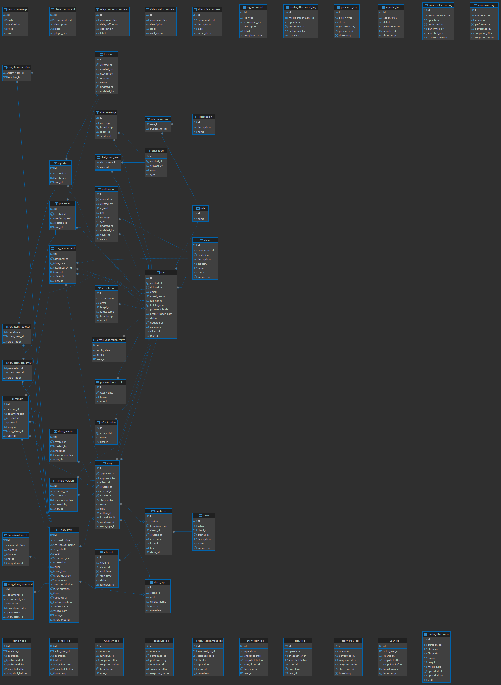
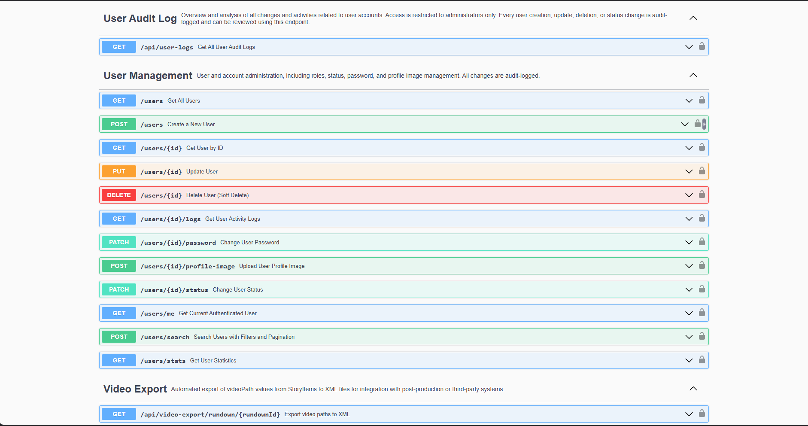

# spring-boot-backend-portfolio

This codebase is curated and maintained by Uros, a backend engineer specializing in enterprise Java/Spring Boot solutions. It demonstrates best practices in modern backend architecture, API design, and production-quality engineering.

This repository demonstrates an extensible, production-grade backend platform tailored for newsrooms, broadcast, and automation use cases. It showcases how to architect, document, and secure a modern Java backend following best enterprise practices.

---

## About this Repository

This public portfolio showcases selected, production-grade code and design patterns from a complete newsroom and broadcast backend platform.
The repository is intended exclusively for code review and technical demonstration, and is **not** designed for direct deployment.

## Features

- 📊 **REST API** with Swagger/OpenAPI documentation
- 🔔 **Real-time WebSocket messaging** (user presence, chat events)
- 🔒 **Custom JWT authentication/authorization**
- 🛡️ **Role-based and permission-based access control** 
- 🚀 **Modular, domain-driven design**
- 📁 **Advanced file & media storage management**
- 🔌 **Integration:** MOS TCP server (Netty), automation protocols
- 🗂️ **Audit logging, user management, multi-tenancy**
- 📄 **Server-side Word/PDF export** for rundowns, stories, and scripts

## Technologies

- Java 21+
- Spring Boot, Spring Security, Spring Data JPA
- Netty (TCP server)
- STOMP/WebSocket
- MariaDB/MySQL
- Maven (build tool)  
  > *Docker support is available in the full, private repository.*
  > 
  > *The full codebase can be adapted for Gradle builds upon request.*

---

## Database ER Diagram

Below is a complete Entity-Relationship (ER) diagram of the core database schema  
(click to enlarge for details). Both the PNG and PDF versions contain all tables and relationships.



> **Download the [full PDF with all tables and relationships](docs/nms_core_schema.pdf) for detailed, high-resolution viewing.**


## Database Schema Auto-Update

For demo and portfolio purposes, this project is configured with:

    spring.jpa.hibernate.ddl-auto=update

This setting demonstrates how automatic database schema updates could be configured in a runnable application, allowing reviewers to understand the approach without manual migration steps.

> ⚠️ **Production Usage Warning**  
>
> - In any real production environment, database schema management **must** be handled via migration tools such as [Flyway](https://flywaydb.org/) or [Liquibase](https://www.liquibase.org/).
> - The `ddl-auto` property should be set to `validate` (or `none`) to prevent accidental schema changes.
> - All credentials and secrets **must** be provided via secure mechanisms and **never committed to version control**.
>
> This configuration is **intentional**, to simplify code review and illustrate project architecture for demo purposes only.  
> **This public repository does not contain a complete, runnable application, and this configuration is provided for demonstration only.**  
> **Do not use this configuration in production.**
>
> _In the full production implementation, all database migrations are version-controlled, all secrets are managed securely, and schema changes are never performed automatically._


---

## ⚠️ Portfolio Notice

**This repository contains only a subset of the codebase, published for portfolio and code review purposes.**  
It is not a complete, runnable application and is not intended for deployment.

- Only key modules, representative controllers, entities, DTOs, and configuration are included.
- Full business logic, all features, and proprietary integrations remain private.
- **Build and run instructions are intentionally omitted** — the project is not meant to be built or executed in this form.

---

## Private Full Project Access

For qualified clients, technical partners, or enterprise code review,  
**full access to the complete codebase is available privately** upon request and under NDA (Non-Disclosure Agreement).

This includes:
- Complete business logic, proprietary integrations, and production configuration
- All entities, repositories, CI/CD, and deployment scripts
- Full Docker and cloud deployment support
- Extended technical documentation

To request a private review or to discuss partnership, please contact me directly via [LinkedIn](https://www.linkedin.com/in/uros-ilic-6a201436a/) or [Upwork](https://www.upwork.com/freelancers/~01fec0932cf5314b14).

---

## API Documentation

All endpoints are fully documented using Swagger/OpenAPI.  
Below are example screenshots from the live Swagger UI:

**User Management endpoints overview:**



**Create User endpoint detail:**


---


## Example API Usage

### User Authentication (Login)
```http
POST /api/auth/login
Content-Type: application/json

{
  "username": "admin",
  "password": "admin123"
}

```

```json
{
  "accessToken": "...",
  "refreshToken": "...",
  "tokenType": "Bearer",
  "username": "admin",
  "fullName": "Admin",
  "role": "ADMIN",
  "user_id": 6
}
```

### Create New User

```http
POST /api/users
Authorization: Bearer <token>
Content-Type: application/json

{
  "username": "johndoe",
  "fullName": "John Doe",
  "email": "john@example.com",
  "password": "SuperSecret123",
  "roleId": 2,
  "clientId": 1
}

```

## Highlighted Modules & Utilities

This codebase is not just a CRUD backend, but demonstrates advanced, reusable modules relevant for modern newsroom and broadcast operations.
Key examples include:

WordGeneratorUtil — robust DOCX export for stories, scripts, and editorial content (Apache POI based). Supports granular export of news items, comments, and metadata for newsroom workflows.

PdfGeneratorUtil — automated PDF generation for rundowns and editorial plans (PDFBox integration), optimized for structured, multi-level content.

GlobalExceptionHandler — uniform, production-grade exception mapping across all REST endpoints.

JwtAuthenticationFilter — custom JWT security filter for stateless, scalable authentication.

WebSocket Messaging System — real-time presence, chat, and newsroom event broadcasting using STOMP/WebSocket with user tracking.

## Project Structure

```text

src/
  main/
    java/
      rs/
        nms/
          newsroom/
            server/
              config/
              controller/
              domain/
              dto/
              exception/
              mos/
              service/
              tcp/
              util/
              websocket/
    resources/
      application.yml
  test/
    java/
      rs/
        nms/
          newsroom/
            server/
              // Unit and integration test classes
docs/
pom.xml
.gitignore
README.md
LICENSE

```
## Testing

Representative unit and integration tests (JUnit 5, Spring Boot Test) are provided in `src/test/java/`.  
These cover the main services and business logic relevant for newsroom automation and backend best practices.

## Observability & Monitoring

This project follows enterprise best practices in observability and operational monitoring:

- **Micrometer metrics** are integrated, exposing key JVM and application metrics via Spring Boot Actuator endpoints.
- **Grafana dashboards** are used to visualize JVM memory, GC activity, CPU usage, thread states, log events, HTTP metrics, and other application insights in real time.

A sample Grafana dashboard (JVM/Micrometer):

[](http://localhost:3000/d/517290dc-ae1b-4c72-9ea6-d9c70f44f6ca/jvm-micrometer?orgId=1&from=now-24h&to=now&refresh=30s)

> **Note:**  
> Some panels display "No data" as this screenshot is from a development environment with limited workloads and integrations enabled.  
> Full observability, alerting, and production monitoring scripts (including advanced metrics and alerting) are available in the private repository and upon request for qualified clients.  
> **Business-oriented dashboards** (with high-level system and workflow health metrics for managers and end-users) can be provided or customized for client needs.

## Portfolio & Contact

For technical consultation, code review, or backend contract work,  
contact via [Upwork](https://www.upwork.com/freelancers/~01fec0932cf5314b14) or [LinkedIn](https://www.linkedin.com/in/uros-ilic-6a201436a/).

## License

This project is licensed under the MIT License. See the [LICENSE](./LICENSE) file for details.

## Contribution

This repository serves as a curated professional portfolio.  
External contributions are not accepted, but code review or technical discussion is welcomed upon request.
